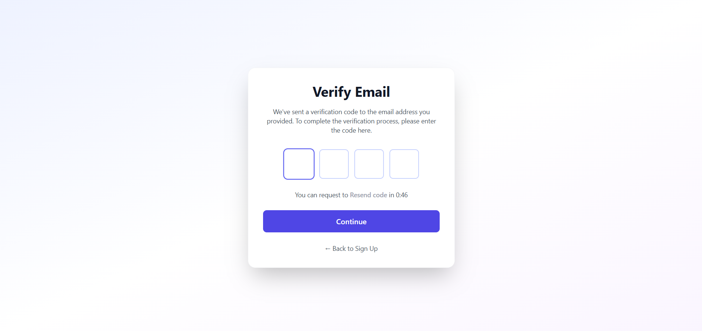

# Job Listing Application

This project is a Job Listing Application built with React and Tailwind CSS. It features live data integration with the Akil Backend API, displaying real job opportunities with comprehensive details, interactive features, and a complete user authentication system.

## Features

-   **User Authentication**: Complete signup, signin, and email verification system with secure token storage
-   **Live API Integration**: Fetches real-time job opportunities from the Akil Backend API
-   **Job Dashboard**: Displays a list of job opportunities with key details (Title, Company, Location, Tags)
-   **Applicant Dashboard**: Provides a detailed view of a selected job, including description, responsibilities, ideal candidate profile, and more
-   **Loading States**: Beautiful loading indicators while fetching data
-   **Error Handling**: Graceful error messages with retry functionality
-   **Responsive Design**: Built with Tailwind CSS for a modern and responsive UI
-   **Form Validation**: Client-side validation for all authentication forms

## Authentication System

The application includes a comprehensive authentication system integrated with the Akil Backend API:

### Authentication Features

- **User Registration**: Sign up with email, password, and full name
- **Email Verification**: OTP-based email verification with countdown timer and resend functionality
- **Secure Login**: Sign in with email and password, with persistent token storage
- **Password Visibility Toggle**: Show/hide password functionality for better UX
- **Client-Side Validation**: 
  - Email format validation
  - Password strength requirements (min 8 chars, uppercase, lowercase, number, special character)
  - Password confirmation matching
  - Required field validation
- **Error Handling**: User-friendly error messages for all authentication failures
- **Token Management**: Secure token storage in localStorage with auto-login capability
- **Protected Navigation**: Authentication-aware routing and navigation

### Authentication API Endpoints

The app integrates with the following Akil Backend endpoints:

- **Signup**: `POST https://akil-backend.onrender.com/signup`
  - Body: `{ name, email, password, confirmPassword, role }`
  
- **Email Verification**: `POST https://akil-backend.onrender.com/verify-email`
  - Body: `{ email, OTP }`
  
- **Login**: `POST https://akil-backend.onrender.com/login`
  - Body: `{ email, password }`
  - Returns: Access token stored in localStorage

### Authentication Flow

1. **Sign Up** → User creates account with name, email, and password
2. **Email Verification** → User enters 4-digit OTP sent to their email
3. **Sign In** → User logs in with credentials and receives access token
4. **Dashboard Access** → Authenticated users can browse job opportunities

## Screenshots

### Authentication Pages

#### Sign Up Page
Complete registration form with Google sign-in option (UI only), email/password fields, and terms acceptance.


#### Email Verification Page
OTP verification with 4-digit input, countdown timer, and resend functionality.



#### Sign In Page
Login form with email and password fields, including show/hide password toggle.


## How to Run

1.  Install dependencies:
    ```bash
    npm install
    ```
2.  Start the development server:
    ```bash
    npm run dev
    ```
3.  Open [http://localhost:5173](http://localhost:5173) in your browser.

## Code Structure

```
src/
├── pages/
│   ├── SignUp.jsx           # User registration page
│   ├── SignIn.jsx           # User login page
│   └── VerifyEmail.jsx      # Email verification page
├── services/
│   └── apiService.js        # API integration and data transformation
├── utils/
│   └── validation.js        # Form validation utilities
├── components/
│   ├── JobDashboard.jsx     # Main job listing page with API data
│   ├── JobCard.jsx          # Individual job card component
│   └── ApplicantDashboard.jsx  # Job detail view
├── App.jsx                  # Main application component with routing
└── main.jsx                 # Application entry point
```

## Technical Highlights

- **Clean Code**: Well-commented and organized code following best practices
- **React Router**: Client-side routing for seamless navigation
- **Error Handling**: Comprehensive error handling for network failures and invalid data
- **Loading States**: User-friendly loading indicators during data fetching
- **Data Safety**: Null checks and fallbacks for missing or incomplete data
- **Responsive Design**: Mobile-friendly layout using Tailwind CSS
- **Form Validation**: Robust client-side validation for all user inputs
- **Secure Authentication**: Token-based authentication with localStorage persistence

## API Data Handling

The application handles various API response scenarios:
- ✅ Successful data fetch (23+ opportunities)
- ✅ Network errors (with retry button)
- ✅ Empty data responses (with helpful message)
- ✅ Missing optional fields (with fallbacks)
- ✅ Invalid image URLs (with placeholder fallback)
- ✅ Authentication errors (with clear feedback)
- ✅ Form validation errors (with inline messages)
