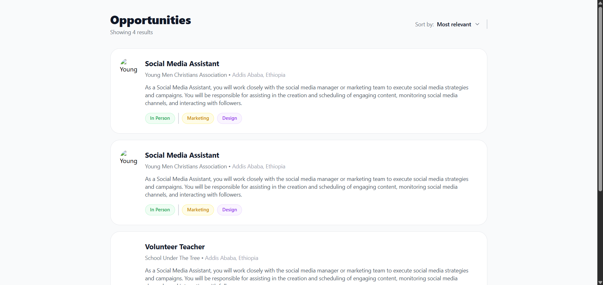
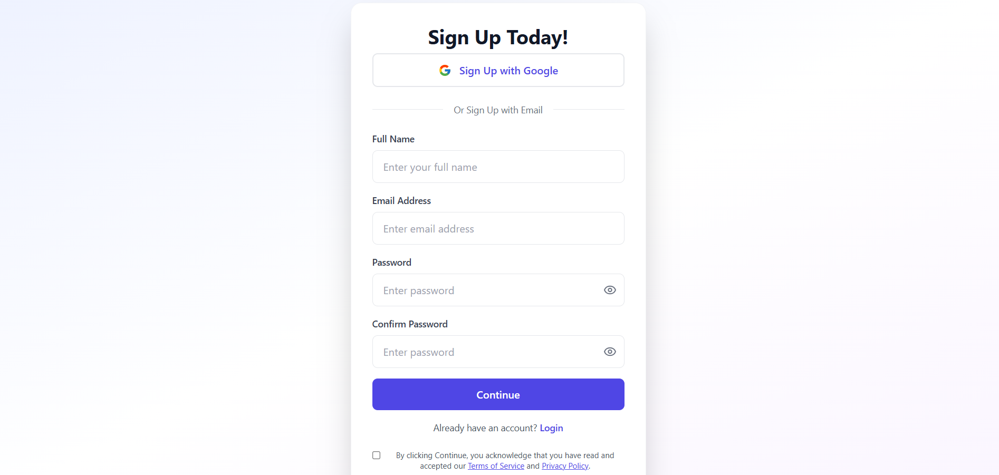

# Job Listing Application

This project is a Job Listing Application built with React and Tailwind CSS. It features a job dashboard displaying available opportunities and a detailed view for each job application.

## Features

-   **Job Dashboard**: Displays a list of job opportunities with key details (Title, Company, Location, Tags).
-   **Applicant Dashboard**: Provides a detailed view of a selected job, including description, responsibilities, ideal candidate profile, and more.
-   **Responsive Design**: Built with Tailwind CSS for a modern and responsive UI.

## Screenshots

### Job Dashboard
The main page listing all available job opportunities.


### Applicant Dashboard (Job Details)
The detailed view when a job card is clicked.


## How to Run

1.  Install dependencies:
    ```bash
    npm install
    ```
2.  Start the development server:
    ```bash
    npm run dev
    ```
3.  Open [http://localhost:5173](http://localhost:5173) in your browser.
